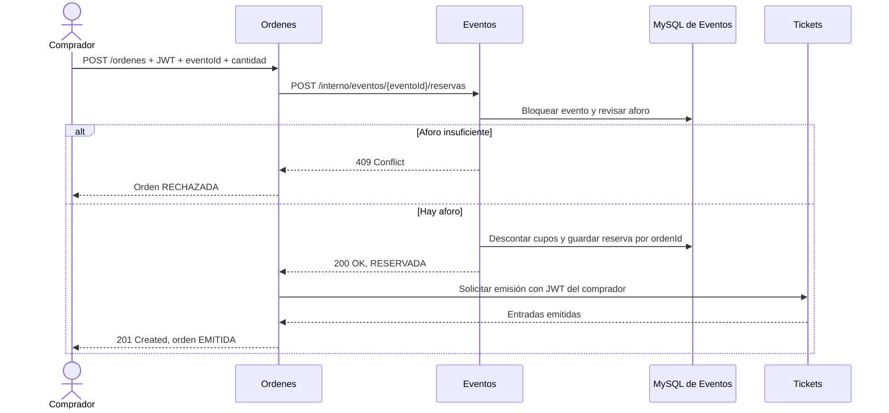

# EventPass — Microservicio de Eventos

Microservicio responsable de administrar eventos y su disponibilidad de cupos. Expone operaciones CRUD para eventos y un endpoint interno de reserva que Órdenes utiliza durante el flujo de compra.

Este servicio mantiene sus propios datos. No consulta las bases de datos de Órdenes, Tickets ni Users; la integración ocurre mediante HTTP.

## Responsabilidades

- Crear, listar, consultar, actualizar y eliminar eventos.
- Registrar las reservas asociadas a un `ordenId`.
- Descontar cupos disponibles de manera transaccional.
- Evitar sobreventa mediante un bloqueo de escritura por evento.
- Responder de forma idempotente cuando se repite una reserva con el mismo `ordenId`, evento y cantidad.

Eventos no valida JWT en el contrato actual. Órdenes valida el JWT del comprador y lo reenvía a Tickets; la llamada de Órdenes a Eventos contiene el `ordenId` y la cantidad solicitada.

## Tecnologías

| Componente | Tecnología |
| --- | --- |
| Lenguaje | Java 17 |
| Framework | Spring Boot 4.1.1 |
| Construcción | Maven Wrapper |
| API | Spring Web MVC / REST |
| Persistencia | Spring Data JPA / Hibernate |
| Base de datos | MySQL 8 |

## Puertos de integración local

| Componente | Puerto | Uso |
| --- | ---: | --- |
| Users | 8080 | Emite el JWT que presenta el comprador a Órdenes |
| Tickets | 8081 | Emite las entradas solicitadas por Órdenes |
| Órdenes | 8083 | Coordina la compra y llama a Eventos y Tickets |
| Eventos | 8084 | Mantiene eventos y reserva cupos |
| MySQL de Eventos | 3308 (host) | Base de datos exclusiva de Eventos |
| MySQL de Órdenes | 3307 (host) | Base de datos exclusiva de Órdenes |

Los puertos pueden ajustarse mediante variables de entorno.

## API

Base URL local: `http://localhost:8084`

### Operaciones CRUD de eventos

| Método | Ruta | Respuesta esperada | Descripción |
| --- | --- | --- | --- |
| `GET` | `/eventos` | `200 OK` | Lista todos los eventos |
| `GET` | `/eventos/{eventoId}` | `200 OK` o `404 Not Found` | Consulta un evento |
| `POST` | `/eventos` | `201 Created` | Crea un evento |
| `PUT` | `/eventos/{eventoId}` | `200 OK` | Actualiza un evento existente |
| `DELETE` | `/eventos/{eventoId}` | `204 No Content` | Elimina un evento |

Ejemplo de creación:

```http
POST /eventos
Content-Type: application/json
```

```json
{
  "nombre": "Evento de prueba",
  "fecha": "2026-12-01",
  "lugar": "Teatro",
  "cupoTotal": 5,
  "cupoDisponible": 5
}
```

El `id` es generado por la base de datos. La respuesta contiene los campos del evento, incluido ese identificador.

### Reservar cupos

```http
POST /interno/eventos/{eventoId}/reservas
Content-Type: application/json
```

```json
{
  "ordenId": 101,
  "cantidad": 2
}
```

Respuesta `200 OK`:

```json
{
  "eventoId": 1,
  "ordenId": 101,
  "cantidad": 2,
  "resultado": "RESERVADA"
}
```

El `eventoId`, `ordenId` y `cantidad` deben ser positivos. Eventos verifica el aforo disponible y persiste la reserva con `ordenId` como identificador único.

| Estado | Situación |
| --- | --- |
| `200 OK` | Reserva realizada, o repetición idéntica de una reserva ya registrada |
| `400 Bad Request` | `eventoId`, `ordenId` o `cantidad` falta o no es positivo |
| `404 Not Found` | No existe el evento solicitado |
| `409 Conflict` | No hay cupos suficientes o el `ordenId` ya tiene una reserva con otros datos |

Si se repite una reserva con el mismo `ordenId`, `eventoId` y cantidad, devuelve la reserva ya guardada sin volver a descontar cupos. Si el mismo `ordenId` se presenta con datos distintos, responde `409 Conflict`.

## Flujo de compra

Órdenes coordina la compra. Primero crea la orden y consulta Eventos para reservar el aforo. Si Eventos confirma la reserva, Órdenes llama a Tickets para emitir las entradas y actualiza el estado de la orden.



Las bases de datos son independientes: Órdenes persiste las órdenes en su MySQL y Eventos administra sus eventos y reservas en el suyo.

## Configuración local

### Requisitos

- JDK 17.
- Docker Desktop y Docker Compose, o una instancia MySQL 8 compatible.
- Para la compra completa: Órdenes, Tickets y Users disponibles además de Eventos.

### Variables de entorno

Copia `.env.example` como `.env` en la raíz del repositorio:

```powershell
Copy-Item .env.example .env
```

Variables principales:

| Variable | Valor local sugerido | Descripción |
| --- | --- | --- |
| `SERVER_PORT` | `8084` | Puerto HTTP de Eventos |
| `DB_URL` | `jdbc:mysql://localhost:3308/BDeventos?...` | Conexión a la base de Eventos |
| `DB_USERNAME` | `root` | Usuario de MySQL local |
| `DB_PASSWORD` | vacío | Compose local permite root sin contraseña |
| `MYSQL_HOST_PORT` | `3308` | Puerto de MySQL publicado en el host |
| `MYSQL_ALLOW_EMPTY_PASSWORD` | `yes` | Permite contraseña vacía para pruebas locales |

`.env` está ignorado por Git. No lo publiques. Hibernate usa `ddl-auto=update` y crea o actualiza las tablas `eventos` y `reservas_evento` al iniciar.

### Levantar MySQL de Eventos

El Compose crea únicamente la base `BDeventos`. Usa el puerto host `3308` para coexistir con el MySQL de Órdenes, que usa `3307`.

```powershell
docker compose -f compose.mysql.yaml up -d
```

Para detener el contenedor sin borrar el volumen de datos:

```powershell
docker compose -f compose.mysql.yaml down
```

### Ejecutar Eventos

Desde la raíz del repositorio, en PowerShell:

```powershell
.\mvnw.cmd spring-boot:run
```

La API quedará disponible en `http://localhost:8084`.

## Pruebas manuales con Postman

Configura una colección con base URL `http://localhost:8084`.

1. Crea un evento con aforo total y disponible de `5` usando `POST /eventos` y guarda el `id` recibido.
2. Reserva `3` cupos con `POST /interno/eventos/{id}/reservas`, `ordenId` positivo y cantidad `3`. Debe responder `200 OK`.
3. Repite exactamente la solicitud con el mismo `ordenId`. Debe responder `200 OK` sin volver a descontar cupos.
4. Intenta reservar más cupos que los disponibles usando otro `ordenId`. Debe responder `409 Conflict` y conservar el aforo.
5. Prueba una cantidad igual a `0`; debe responder `400 Bad Request`.
6. Para probar la integración, inicia también Users, Órdenes y Tickets. Crea una compra desde `POST http://localhost:8083/ordenes` con un JWT de comprador válido; se espera `201 Created` y estado `EMITIDA`.

En la prueba integrada realizada, Órdenes devolvió `201 Created` con estado `EMITIDA` y un ticket, y la consulta posterior del evento mostró que su aforo disponible se redujo en uno. La consulta de Órdenes devolvió estado `EMITIDA`; ese endpoint no incluye los tickets y muestra `tickets: null`.

## Alcance y limitaciones

- El endpoint interno de reservas no valida JWT según el contrato actual; se espera que la llamada ocurra entre servicios del entorno de integración.
- Los endpoints CRUD tampoco tienen autenticación ni autorización implementadas.
- La concurrencia en una reserva se protege bloqueando la fila del evento durante la transacción; la prueba manual informada no fue una prueba de carga concurrente.
- Si Eventos reserva cupos y después falla la emisión de Tickets, no hay compensación automática para liberar esos cupos.
- La validación detallada de los campos del CRUD y los formatos de fecha sigue siendo básica.
- No se contempla reembolso ni liberación manual de entradas en este alcance.
- Esta guía cubre la ejecución local del contrato evaluado; no describe despliegue en AWS.

## Estructura del código

```text
src/main/java/Event_pass/eventos/
├── controller/   # Endpoints REST de eventos y reservas
├── model/        # Entidades Evento y Reserva
├── repository/   # Persistencia JPA y bloqueo para reservar cupos
└── services/     # Reglas de eventos y reservas
```

## Flujo de ramas

`main` contiene la versión estable, `develop` integra los cambios y `feature/*` contiene el trabajo funcional. Las ramas feature se proponen mediante PR hacia `develop`; el PR y su revisión los realiza el equipo.
